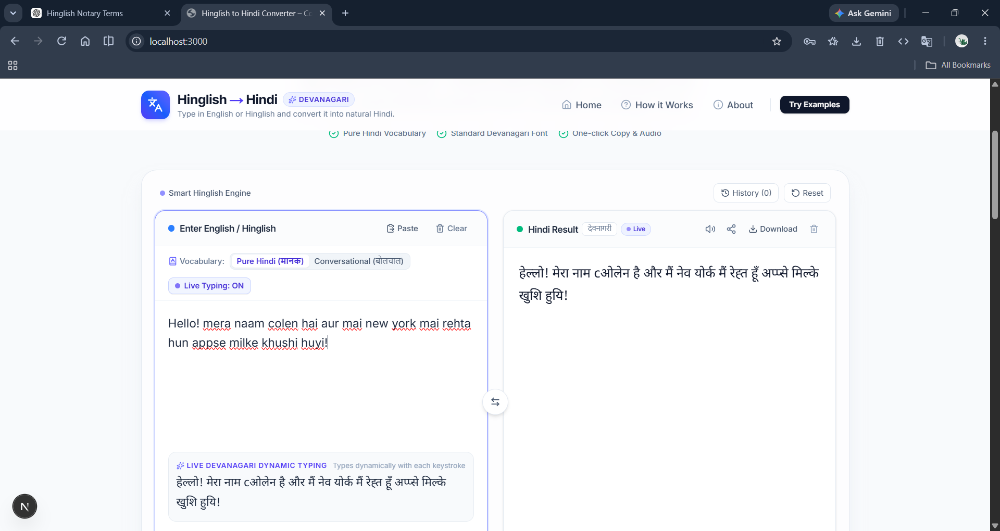
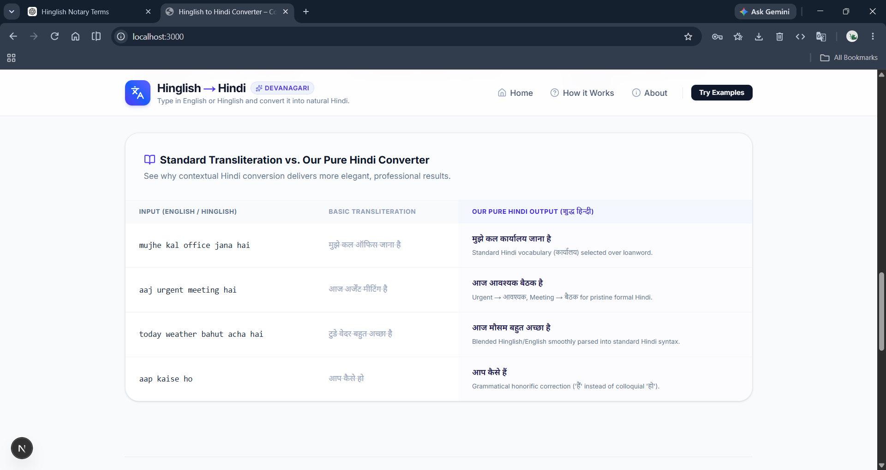
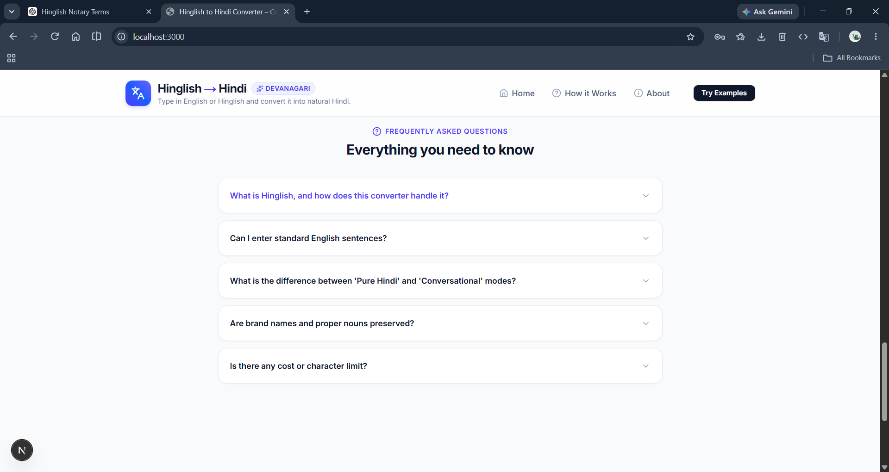

# Hinglish to Hindi Converter

A modern AI-powered web app that converts English and Hinglish (Roman Hindi) text into natural, fluent Hindi written in Devanagari script.

This project uses Next.js on the frontend and Google Gemini AI on the backend to translate casual Romanized Hindi, English, and mixed-language inputs into polished Hindi while preserving meaning, grammar, and context.

## Live Demo

The app is designed to provide:

- Instant text conversion from English / Hinglish to Hindi
- Two translation styles: Pure Hindi and Conversational Hindi
- Live preview while typing
- Copy-to-clipboard support
- Audio playback for Hindi output
- Past translation history in the browser
- Clean, responsive interface for desktop and mobile
  
## Preview





## Demo
[▶️Demo](assets/hindi-translator.mp4)

## Features

### Natural Translation
- Converts Roman Hindi such as: "mujhe kal office jana hai"
- Converts standard English such as: "I want to learn Hindi"
- Handles mixed input such as: "today weather bahut acha hai"
- Produces grammatically correct Hindi in Devanagari script

### Translation Modes
- Pure Hindi mode: prefers standard vocabulary such as कार्यालय, बैठक, बाज़ार
- Conversational mode: keeps familiar everyday terms in Devanagari when appropriate

### User Experience
- Fast, real-time typing preview
- One-click output copy
- Text-to-speech support for Hindi pronunciation
- Example prompts for quick testing
- Responsive design with a modern UI

## Tech Stack

- Next.js 15
- React 19
- TypeScript
- Tailwind CSS
- Google Gemini AI via @google/genai
- Lucide React icons

## Project Structure

```bash
.
├── app/
│   ├── api/
│   │   └── convert/
│   │       └── route.ts
│   ├── globals.css
│   ├── layout.tsx
│   └── page.tsx
├── components/
│   ├── AboutModal.tsx
│   ├── Converter.tsx
│   ├── ExamplePrompts.tsx
│   ├── Footer.tsx
│   ├── Header.tsx
│   ├── HowItWorks.tsx
│   ├── InputBox.tsx
│   └── OutputBox.tsx
├── lib/
│   ├── translator.ts
│   └── transliterate.ts
├── .env.example
├── .eslintrc.json
├── eslint.config.mjs
├── next.config.ts
├── package.json
├── postcss.config.mjs
├── tsconfig.json
├── README.md
└── metadata.json
```

## Getting Started

### 1. Install dependencies

```bash
npm install
```

### 2. Set up environment variables

Copy the example file and add your Gemini API key:

```bash
cp .env.example .env.local
```

Then update `.env.local`:

```env
GEMINI_API_KEY="your_google_gemini_api_key"
APP_URL="http://localhost:3000"
```

### 3. Run the app

```bash
dnpm run dev
```

Then open:

```bash
http://localhost:3000
```

## Build

To create a production build:

```bash
npm run build
```

To start the production server:

```bash
npm run start
```

## Environment Variables

| Variable | Required | Description |
| --- | --- | --- |
| GEMINI_API_KEY | Yes | API key for Google Gemini AI translation |
| APP_URL | Optional | Base application URL used for app metadata and routing |

## Example Inputs

### Hinglish
- "mujhe kal office jana hai"
- "aap kaise ho"
- "weather bahut acha hai"

### English
- "I want to learn Hindi"
- "The meeting is scheduled for tomorrow"
- "Where are you going today?"

### Expected Output
- "मुझे कल कार्यालय जाना है"
- "मैं हिन्दी सीखना चाहता हूँ"
- "आज मौसम बहुत अच्छा है"

## Notes

This application focuses on translating Romanized Hindi and mixed-language text into idiomatic Hindi rather than doing a simple character-by-character transliteration. The translation logic is optimized to prefer natural grammar, correct vocabulary, and Devanagari script output.

## License

This project is for educational and portfolio/demo purposes. You are free to modify and extend it for your own use.

## Author

Built as an AI Studio app for Hindi language conversion and learning utilities.
